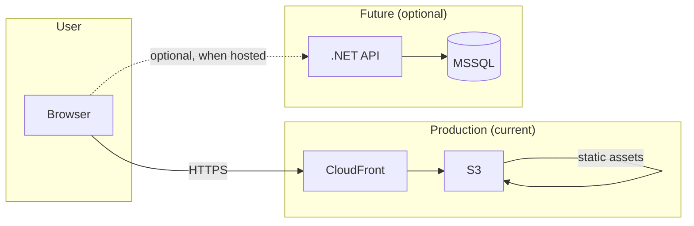
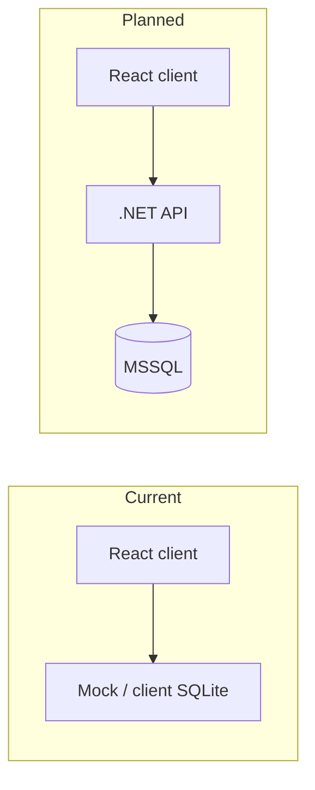

# Architecture

High-level technical architecture for justingritten.dev.

## Overview

The site is a **static React SPA** (deployed to S3/CloudFront) with a **.NET Web API** deployed alongside it (see [deployment.md](./deployment.md)). The SPA is the primary visitor surface; the API backs contact, metrics, and future authenticated features.

## Architecture diagram

Mermaid diagram (render in GitHub, VS Code, or export to PNG). A whiteboard or hand-drawn PNG can be added later in `docs/diagrams/` for quick visual reference.



**Data flow (current vs planned):**



## User flow (guest journey)

For a human-readable map of pages and navigation (including a tree-style flow), see [`docs/sitemap.md`](./sitemap.md). This file focuses on the technical architecture, stack, and data flow.

## Components

| Layer | Technology | Purpose |
|-------|------------|---------|
| **Frontend** | React 19, TypeScript, Vite, Radix UI | Portfolio content + demo components (see [system-overview](./system-overview.md#demos)) |
| **Backend** | .NET 10 Web API, EF Core, SQLite | API-backed features, including contact persistence and pluggable email notifications |
| **Hosting** | AWS S3 + CloudFront (SPA); Elastic Beanstalk (API) | Static site + .NET API in production (see [deployment.md](./deployment.md)) |

## Data flow

- **Current:** The React app can use a client-side SQLite (or mock) for demos; it does not depend on the API for persistence in production.
- **Planned:** API will be upgraded to MSSQL and become the primary data layer; client will call the API instead of client-side storage. The existing Products CRUD and repository pattern are the template for that migration.

## Key design choices

- **Path alias:** In the client, `@/` resolves to `src/` (see `client/vite.config.ts`).
- **API base URL:** Client uses `VITE_API_URL` (default `http://localhost:5237`); see `client/src/api/client.ts`.
- **CORS:** API allows the React dev origins (`localhost:5173`, `localhost:3000`). If the API is later hosted on a different origin (e.g. `api.justingritten.dev`), CORS must include the frontend origin.
- **Testing:** Client tests use Vitest and React Testing Library (see [ADR 0003](decisions/0003-testing-approach.md)); server tests will use xUnit when added.
- **Email provider abstraction:** Contact email delivery is behind `IContactEmailSender` with provider-specific infrastructure implementations (`Resend`, `Ses`, `NoOp`) selected via `EMAIL_PROVIDER` in `Program.cs`. This keeps controller/application flow provider-agnostic and supports future provider swaps with DI/config changes only.
- **Backend layering (controller → service → repository):** Controllers stay thin (HTTP only). **Application and orchestration logic** (aggregations, use-case steps, calling multiple dependencies) lives in **services** under `server/Services/` behind interfaces in `server/Interfaces/` (e.g. `IMetricsService` coordinating `IMetricRepository`). **Repositories** own persistence and EF Core only. **Infrastructure ports** (e.g. `IContactEmailSender`) are injected into whichever layer needs them—typically a **service** when a flow combines persistence and outbound calls; controllers should not accumulate business rules. New endpoints should follow this pattern; older controllers may still call a repository directly until refactored (see [ADR 0007](decisions/0007-thin-controllers-repository-and-dto-boundary.md)).
- **Metrics API shape:** Metrics keeps focused single-route summaries (`GET /api/metrics/summary?route=...`) and also exposes an aggregate period endpoint (`GET /api/metrics/overview?period=hour|day|week|month`) so dashboard views can hydrate date-scoped route/outbound totals in one call (see [ADR 0008](decisions/0008-metrics-overview-period-endpoint.md)).
- **API as product:** Treat the API as a reusable backend for multiple first-party clients (web SPA, future iOS app, future Android/desktop). API contracts should be client-agnostic, stable, and documented so new frontends can integrate without backend rewrites.
- **Contract-first evolution:** Prefer explicit API versioning and consistent request/response and error envelopes to reduce client breakage as endpoints evolve.
- **OpenAPI as integration artifact:** Keep OpenAPI accurate and publishable so typed client generation is possible for future frontends.
- **Authentication (SaaS):** **`ClerkProvider`** on `/saas` when `VITE_CLERK_PUBLISHABLE_KEY` is set; JWT Bearer validation for protected routes (see [ADR 0010](decisions/0010-clerk-saas-authentication.md)). **Supabase Auth** remains the documented alternative ([ADR 0009](decisions/0009-auth-observability-and-infra-choices.md)). **Tenancy:** `TenantClient`, memberships, invitations, and per-user workspace preferences are stored in SQLite and exposed under **`/api/v1/Tenancy/*`** for the post-sign-in hub ([ADR 0011](decisions/0011-multi-tenant-clients-and-workspace-hub.md)). A seeded **Northwinds Demo** tenant and **lazy pending invite** per email on workspace load are documented in [ADR 0012](decisions/0012-northwinds-demo-tenant-and-auto-invite.md). Resource-level authorization on future tenant data is still to be added.
- **Observability:** **AWS structured logging** (e.g. CloudWatch on EB) with correlation IDs—not a paid third-party error/APM product at portfolio scope (ADR 0009).
- **Product metrics:** **First-party** metrics API only ([ADR 0008](decisions/0008-metrics-overview-period-endpoint.md)); no requirement for external analytics SDKs for the portfolio phase.
- **Caching / Redis:** **Deferred**—no Upstash, ElastiCache, or Redis until multi-instance, heavy rate limiting, or similar need (ADR 0009).

## Repo layout

```
client/     → React SPA (src: api, components, hooks, types, styles, utils)
server/     → .NET API (Controllers, Data, DTOs, Interfaces, Models, Repositories, Services)
docs/       → Design and intention (this folder)
.github/    → CI/CD (deploy workflow)
```

See [system-overview.md](./system-overview.md) for a more detailed map and [decisions/](./decisions/) for recorded decisions.
