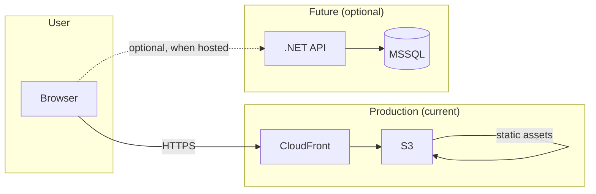
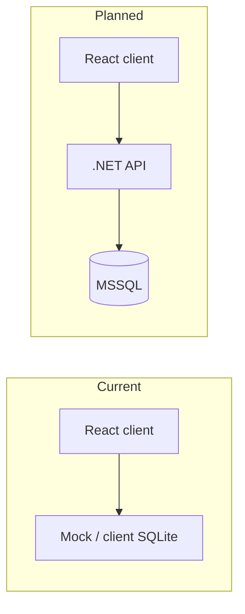

# Architecture

High-level technical architecture for justingritten.dev.

## Overview

The site is a **static React SPA** (deployed to S3/CloudFront) with an optional **.NET Web API** used as a foundation for future backend features. The live production site currently serves only the frontend; the API is for local development and future hosting.

## Architecture diagram

Mermaid diagram (render in GitHub, VS Code, or export to PNG). A whiteboard or hand-drawn PNG can be added later in `docs/diagrams/` for quick visual reference.



**Data flow (current vs planned):**



## User flow (guest journey)

For a human-readable map of pages and navigation (including a tree-style flow), see [`docs/sitemap.md`](./sitemap.md). This file focuses on the technical architecture, stack, and data flow.

## Components

| Layer | Technology | Purpose |
|-------|------------|---------|
| **Frontend** | React 19, TypeScript, Vite, Radix UI | Portfolio content + demo components (see [system-overview](./system-overview.md#demos)) |
| **Backend** | .NET 10 Web API, EF Core, SQLite | API-backed features, including contact persistence and pluggable email notifications |
| **Hosting** | AWS S3 + CloudFront | Static site; client-only in production |

## Data flow

- **Current:** The React app can use a client-side SQLite (or mock) for demos; it does not depend on the API for persistence in production.
- **Planned:** API will be upgraded to MSSQL and become the primary data layer; client will call the API instead of client-side storage. The existing Products CRUD and repository pattern are the template for that migration.

## Key design choices

- **Path alias:** In the client, `@/` resolves to `src/` (see `client/vite.config.ts`).
- **API base URL:** Client uses `VITE_API_URL` (default `http://localhost:5237`); see `client/src/api/client.ts`.
- **CORS:** API allows the React dev origins (`localhost:5173`, `localhost:3000`). If the API is later hosted on a different origin (e.g. `api.justingritten.dev`), CORS must include the frontend origin.
- **Testing:** Client tests use Vitest and React Testing Library (see [ADR 0003](decisions/0003-testing-approach.md)); server tests will use xUnit when added.
- **Email provider abstraction:** Contact email delivery is behind `IContactEmailSender` with provider-specific infrastructure implementations (`Resend`, `Ses`, `NoOp`) selected via `EMAIL_PROVIDER` in `Program.cs`. This keeps controller/application flow provider-agnostic and supports future provider swaps with DI/config changes only.

## Repo layout

```
client/     → React SPA (src: api, components, hooks, types, styles, utils)
server/     → .NET API (Controllers, Data, DTOs, Interfaces, Models, Repositories, Services)
docs/       → Design and intention (this folder)
.github/    → CI/CD (deploy workflow)
```

See [system-overview.md](./system-overview.md) for a more detailed map and [decisions/](./decisions/) for recorded decisions.
